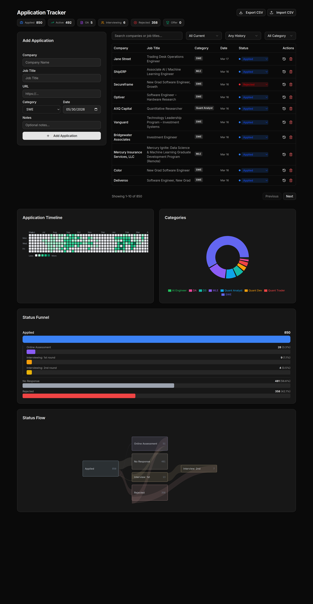
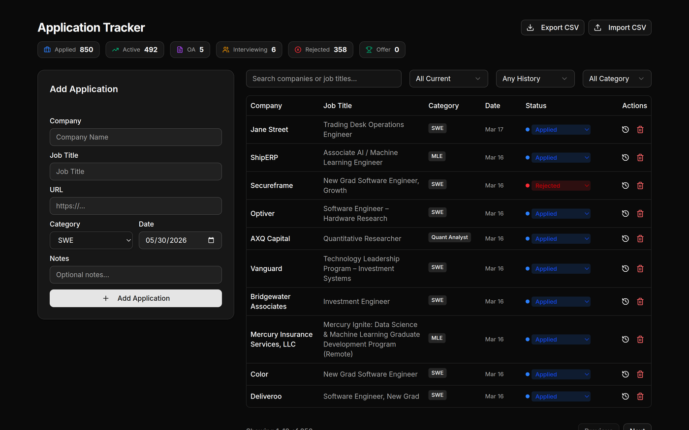
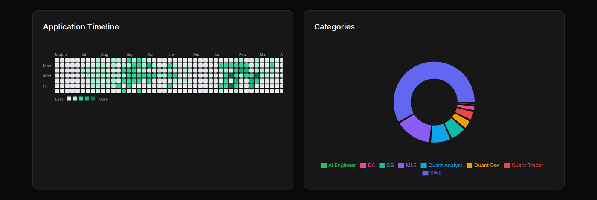
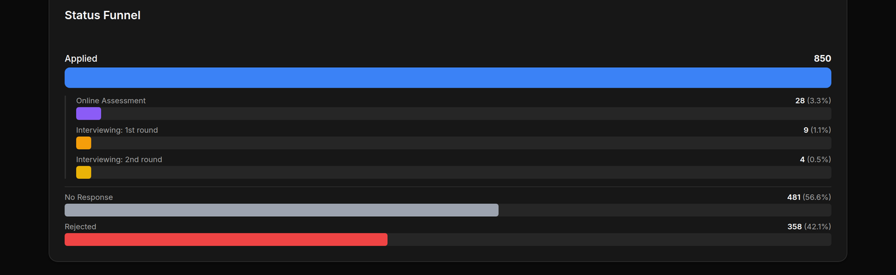
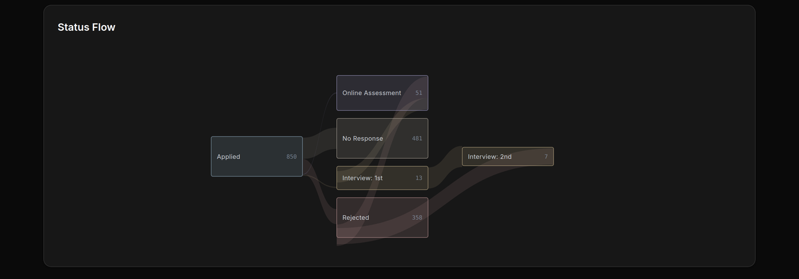
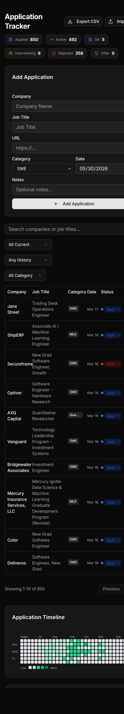

# ATS — Application Tracking System

[](https://github.com/drink970082/personal-ats/actions/workflows/ci.yml)
[](./LICENSE)

A self-hosted job-application tracker built with **Next.js 14**, **Prisma**, and **SQLite**. Keep every application, every status transition, and every interview round in one place — then look at it visually instead of scrolling a spreadsheet.

<p align="center">
  
</p>

This repo is **one project made of two cooperating services** that share a
single SQLite database:

- [`apps/web`](./apps/web) — the Next.js tracker + dashboards you interact with.
- [`apps/worker`](./apps/worker) — a Python pipeline that *feeds* the tracker:
  it scans company ATS boards, scores each posting against your resume with a
  local LLM, auto-tailors a one-page resume for the best matches, and pings you
  on Telegram. You review/apply by hand, then one-click "Mark Applied" turns a
  posting into a tracked application.

See [**docs/SETUP.md**](./docs/SETUP.md) for full setup and
[`docs/pipeline-design.md`](./docs/pipeline-design.md) for the design.

---

## Why

Job hunting generates a lot of state per application: which company, which role, when applied, current status, how many interview rounds, when it stalled, what category (SWE / MLE / DS / Quant / etc.). A spreadsheet handles the first two columns fine but falls over once you want to ask "what's my offer rate by category?" or "where do most of my applications die?" This app is the spreadsheet plus the answers.

---

## Architecture

Two services, one shared SQLite database. The **worker** discovers and prepares
jobs; the **web app** is where you triage and track them. They never call each
other directly — the database (and a shared folder of tailored PDFs) is the only
contract between them.

```
            ATS boards          Ollama (host GPU)   Claude API      Telegram
          Greenhouse/Lever/Ashby      │                 │              ▲
                  │                    │                 │              │
                  ▼                    ▼                 ▼              │
   ┌───────────────────────────────────────────────────────────────────┐
   │  apps/worker  (Python, scheduled)                                  │
   │     fetch ──► score ──► tailor (1-page PDF) ──► notify             │
   └───────────────┬───────────────────────────────────┬───────────────┘
                   │ writes job_postings rows           │ writes PDFs
                   ▼                                     ▼
            ┌────────────┐                        ┌────────────┐
            │   db/      │   shared SQLite        │  resumes/  │  shared volume
            │ (WAL mode) │◄──────────────────────►│  (PDFs)    │
            └─────┬──────┘                        └─────┬──────┘
                  │ reads postings / writes applications │ serves PDFs
                  ▼                                       ▼
   ┌───────────────────────────────────────────────────────────────────┐
   │  apps/web  (Next.js)                                               │
   │   Discovered Jobs tab  ──"Mark Applied"──►  Applications + charts  │
   └───────────────────────────────────────────────────────────────────┘
                  ▲
                  │  you (browser): triage, apply by hand, track
```

Both run together with one `docker compose up` from the repo root; the database
is mounted as a **directory** so SQLite's WAL sidecars are shared across both
containers. The worker invests nothing in auto-apply — a human is always in the
loop.

---

## Features

### Header KPIs + searchable, paginated table

<p align="center">
  
</p>

- **Status KPIs** across the top: Applied / Active / Online Assessment / Interviewing / Rejected / Offer
- **Inline status editing** — change an application's status from the table dropdown; the previous status is recorded in history
- **Filters**: by current status, by historical status (find apps that ever reached "Final Round"), by category, plus free-text search over company and job title
- **CSV import / export** — round-trip data with one click
- **Edit URL, date, notes** in place; the URL becomes a click-through link

### Activity heatmap + category donut

<p align="center">
  
</p>

- **Application Timeline** — GitHub-contributions-style heatmap over the last 365 days. Each cell is a day; colour intensity scales with number of applications submitted. Hover for an exact count.
- **Categories** — donut showing the mix across SWE, MLE, DS, DA, Quant Dev/Analyst/Trader, AI Engineer, Others.

### Status funnel

<p align="center">
  
</p>

Linear breakdown of how the 850 applications fanned out across the funnel — every stage shows raw count and percentage so you can see conversion at a glance.

### Status flow (Sankey)

<p align="center">
  
</p>

Reconstructs the actual transitions per application from the `status_history` table and draws them as a Sankey. The palette is intentionally muted (slate / sky / indigo / amber / gold / emerald / rose / stone, all desaturated) so the flow geometry leads, not the colour.

### Per-application history modal

Click the clock icon on any row to open a modal showing every status this application has been in, with timestamps. From the modal you can edit application metadata, add a new status transition, or delete a past history entry.

### Discovered Jobs (semi-automated pipeline)

A second tab next to **Applications**. The [`apps/worker`](./apps/worker) worker
populates a `job_postings` table on a schedule; the UI is where you triage it:

- **Scored queue** — postings sorted by an LLM match score (0–100), filterable by
  min-score, pipeline status, and free-text search.
- **JD + score detail dialog** — full job description plus the model's
  matched / missing keywords and reasoning.
- **Tailored resume per job** — download the auto-generated one-page PDF; a badge
  warns if it spilled past one page.
- **One-click "Mark Applied"** — after you apply by hand, this creates a tracked
  application (carrying company / title / URL) and links it back to the posting,
  so it flows straight into every chart above.

The pipeline: **fetch** (Greenhouse / Lever / Ashby public APIs) → **score**
(local Ollama, GPU) → **tailor** (Claude + `tectonic` → single-page PDF) →
**notify** (Telegram). Investing nothing in auto-apply — a human is always in the
loop. Full walkthrough in [**docs/SETUP.md**](./docs/SETUP.md).

### Mobile / responsive

<p align="center">
  
</p>

Everything stacks vertically below ~640px. Table remains scrollable; charts shrink to fit.

---

## Stack

| Layer       | Choice                                                            |
| ----------- | ----------------------------------------------------------------- |
| Framework   | Next.js 14 (App Router, Server Actions, standalone output)        |
| Language    | TypeScript                                                        |
| Database    | SQLite via Prisma 6                                               |
| UI          | React 18, Tailwind CSS 4, Radix UI primitives (shadcn-style)      |
| Charts      | Recharts (donut) + hand-rolled SVG (heatmap, funnel, Sankey)      |
| Forms       | react-hook-form + Zod                                             |
| Tests       | Jest + Testing Library + jest-mock-extended (web); pytest (worker) |
| Container   | Alpine multi-stage build, runs as non-root with UID/GID arg       |
| **Pipeline**| Python 3.11 worker: APScheduler, Greenhouse/Lever/Ashby APIs, Ollama (scoring), Claude + `tectonic` (resume tailoring), Telegram (alerts) |

---

## Quick start

### Local dev

```bash
cd apps/web
npm install
npx prisma generate
npm run dev
```

Open http://localhost:3000. (Or from the repo root: `make install && make dev`.)

If `db/applications.db` does not exist yet, create it with:

```bash
npx prisma db push
```

### Docker (recommended for "just run it")

The container does **not** ship with a database — the host's `db/` directory is bind-mounted so your data survives image rebuilds and lives where you can back it up.

The root [`docker-compose.yml`](./docker-compose.yml) defines **two** services: `web` and `worker` (the pipeline). Run everything **from the repo root**. To start **only the web app**:

```bash
UID=$(id -u) GID=$(id -g) docker compose up web --build -d
```

That starts the app on http://localhost:3000 with the host `db/` directory mounted at `/data`.

To run the **full pipeline too**, first create the worker's config + secrets (otherwise the worker's `.env` mount fails) — see [**docs/SETUP.md**](./docs/SETUP.md) — then:

```bash
UID=$(id -u) GID=$(id -g) docker compose up --build -d
```

Or with the `Makefile`: `make up`.

Or the web app without compose:

```bash
docker build \
  --build-arg UID=$(id -u) \
  --build-arg GID=$(id -g) \
  -t ats-web:local apps/web

docker run -d --name ats-web -p 3000:3000 \
  -e DATABASE_URL="file:/data/applications.db" \
  -v "$PWD/db:/data" \
  ats-web:local
```

> **Note:** the database is mounted as a **directory** (`db/` → `/data`), not a single file. This is required so SQLite's WAL `-wal`/`-shm` sidecar files are shared between the web and worker containers; a single-file mount silently breaks cross-process WAL. The `UID`/`GID` build args make the container user own the bind-mounted files so writes work without `chmod 777`.

---

## Configuration

The **web app** needs one environment variable; the **pipeline worker** needs a few (see [docs/SETUP.md](./docs/SETUP.md)). Things to know:

- **`DATABASE_URL`** — the Prisma datasource is now `env("DATABASE_URL")`. Locally it's set in [`apps/web/.env`](./apps/web/.env) to `file:./applications.db` (resolves to the `prisma/applications.db` symlink). In Docker, `docker-compose.yml` overrides it to an absolute path on the shared volume (`file:/data/applications.db`). This indirection is what lets the same schema serve both local dev and the directory-mounted container db.
- **Time zone** — the heatmap uses the server's local "today" as its reference. If you deploy on a server in a different TZ from where you live, set `TZ` on the container.
- **Static / dynamic** — the root page is marked `export const dynamic = 'force-dynamic'` so it always reads from the live database; there is no stale-cache problem.
- **Worker secrets** — `ANTHROPIC_API_KEY`, `TELEGRAM_BOT_TOKEN`, `TELEGRAM_CHAT_ID`, `OLLAMA_HOST` live in `apps/worker/.env` (gitignored). See [docs/SETUP.md](./docs/SETUP.md).

---

## Data model

```prisma
model applications {
  id              Int              @id @default(autoincrement())
  company_name    String
  job_title       String
  application_url String?
  date_applied    String
  category        String?
  status          String
  notes           String?
  last_updated    String?
  status_history  status_history[]
}

model status_history {
  id             Int          @id @default(autoincrement())
  application_id Int
  status         String
  timestamp      String
  applications   applications @relation(fields: [application_id], references: [id], onDelete: Cascade)
}

// Populated by the apps/worker pipeline; triaged in the Discovered Jobs tab.
model job_postings {
  id              Int           @id @default(autoincrement())
  source          String        // greenhouse | lever | ashby
  external_id     String        // board's job id
  company_name    String
  job_title       String
  location        String?
  job_url         String
  description     String        // full JD (fed to the LLM)
  score           Int?          // 0–100, from Ollama
  score_detail    String?       // JSON: { matched, missing, reasoning }
  resume_tex      String?       // tailored LaTeX source
  resume_path     String?       // tailored PDF path on the shared volume
  resume_pages    Int?          // page count after compile (1 = good)
  pipeline_status String        @default("new") // new|scored|tailored|notified|applied|discarded|failed
  pipeline_error  String?       // last error when status='failed'
  attempts        Int           @default(0)
  application_id  Int?          // back-link once marked applied
  application     applications? @relation(fields: [application_id], references: [id], onDelete: SetNull)
  created_at      String
  updated_at      String?

  @@unique([source, external_id]) // dedup key
}
```

Deleting an application cascades to its status history. A `job_postings` row is deduped on `(source, external_id)` and advances through its `pipeline_status` state machine. Dates are stored as ISO strings (`YYYY-MM-DD`) for sortability and timezone-independence.

### Statuses (in funnel order)

`Applied` → `Online Assessment` → `Phone Screen` → `Interviewing: 1st…5th round` → `Final Round` → `Offer` → `Accepted`

Plus terminal states: `Rejected`, `Withdrew`, `Ghosted`.

### Categories

`SWE`, `MLE`, `DS`, `DA`, `Quant Dev`, `Quant Analyst`, `Quant Trader`, `AI Engineer`, `Others`.

Both lists live in [`apps/web/src/lib/constants.ts`](./apps/web/src/lib/constants.ts) — edit there to extend.

---

## Project layout

```
ats/
├── README.md  LICENSE  CONTRIBUTING.md  CHANGELOG.md  .editorconfig
├── Makefile                         # unified install/dev/test/up entry points
├── docker-compose.yml               # orchestrates BOTH services (run from root)
├── .github/workflows/ci.yml         # runs Jest + pytest on push / PR
├── docs/
│   ├── SETUP.md                     # full end-to-end environment setup guide
│   ├── pipeline-design.md           # pipeline design doc
│   └── images/                      # README screenshots (tracked)
├── db/
│   └── applications.db              # shared SQLite database (gitignored)
├── resumes/                         # tailored PDF output volume (gitignored)
│
└── apps/                            # the two cooperating services
    │
    ├── web/                         # ── Next.js web app (service: web) ──
    │   ├── .env                     # DATABASE_URL for local dev
    │   ├── prisma/
    │   │   ├── schema.prisma        # applications + status_history + job_postings
    │   │   └── applications.db      # symlink → ../../../db/applications.db
    │   ├── src/
    │   │   ├── app/
    │   │   │   ├── page.tsx         # dashboard entry; SSR + force-dynamic
    │   │   │   └── api/resume/[id]/route.ts  # streams tailored PDFs (only API route)
    │   │   ├── components/
    │   │   │   ├── Dashboard.tsx    # Applications ↔ Discovered Jobs tabs
    │   │   │   ├── DiscoveredJobsTable.tsx    # the scored pipeline queue
    │   │   │   ├── JobDetailModal.tsx         # JD + score-detail dialog
    │   │   │   ├── ApplicationTable.tsx / StatusHistoryModal.tsx
    │   │   │   ├── KPIGrid.tsx / TimelineHeatmap.tsx / CategoryDonut.tsx
    │   │   │   ├── StatusFunnel.tsx / SankeyChart.tsx / AddApplicationForm.tsx
    │   │   │   ├── ui/              # Radix-based primitives (shadcn-style)
    │   │   │   └── __tests__/       # component tests
    │   │   └── lib/                 # actions.ts (Server Actions), db.ts, constants.ts
    │   ├── e2e/                     # Playwright browser verification + screenshots
    │   └── Dockerfile
    │
    └── worker/                      # ── Python pipeline worker (service: worker) ──
        ├── config.yaml.example      # → copy to config.yaml (companies, filters, thresholds)
        ├── .env.example             # → copy to .env (API keys, Telegram, Ollama)
        ├── resume/                  # *.example → copy to master.tex + resume.txt (gitignored)
        ├── ats_worker/
        │   ├── fetch/{greenhouse,lever,ashby}.py  # board adapters → unified dict
        │   ├── config.py            # load/validate config.yaml
        │   ├── db.py                # SQLite: WAL pragmas, dedup upsert, state writes
        │   ├── score.py             # Ollama scoring (local, GPU)
        │   ├── tailor.py            # Claude + tectonic single-page loop
        │   ├── notify.py            # Telegram alert + PDF
        │   ├── pipeline.py          # fetch→score→tailor→notify state machine
        │   └── run.py               # APScheduler entrypoint (--once for a test pass)
        ├── tests/                   # pytest (fully mocked; no network needed)
        └── Dockerfile               # python:3.11-slim + tectonic (bundle prewarmed)
```

---

## Testing

```bash
make test            # both suites from the repo root
# or individually:
make test-web        # cd apps/web && npm test
make test-worker     # cd apps/worker && python -m pytest
```

The **web** suite covers:

- Server actions in `apps/web/src/lib/actions.ts` — CRUD on applications, status history, KPI aggregations, CSV import/export, plus the discovered-jobs actions (`getJobPostings` / `markJobApplied` / `discardJobPosting`), with Prisma mocked via `jest-mock-extended`
- Component behaviour on the tables, the add form, and the modals

The **pipeline worker** suite needs no network / Ollama / Claude / tectonic —
everything is dependency-injected — and covers the fetch adapters, the dedup/WAL
db layer, scoring, the single-page tailor loop, and the pipeline state machine.

---

## Scripts

The root `Makefile` wraps everything (`make help` to list targets). The web
scripts run from `apps/web/`:

| Command         | What it does                              |
| --------------- | ----------------------------------------- |
| `npm run dev`   | Start the Next.js dev server              |
| `npm run build` | Production build (`output: standalone`)   |
| `npm start`     | Run the production build                  |
| `npm run lint`  | ESLint                                    |
| `npm test`      | Run Jest                                  |

---

## Notes & design choices

- **Server Actions, not REST.** All mutations go through Next.js Server Actions in `apps/web/src/lib/actions.ts`. The single exception is `GET /api/resume/[id]`, which streams a tailored PDF (binary file responses don't fit the Server Action model).
- **Two processes, one database.** The web app and the Python worker co-write `db/applications.db`. SQLite WAL + `busy_timeout` make this safe; the worker writes `job_postings`, the app mostly reads them and writes `applications`. The schema is owned solely by Prisma — the worker issues no DDL.
- **One Prisma client.** `apps/web/src/lib/db.ts` exports a process-singleton so Next.js's dev hot-reload doesn't leak connections.
- **Charts are mostly hand-rolled SVG.** The heatmap, funnel, and Sankey are written directly so they look exactly right on dark backgrounds without per-chart-library theming. Only the category donut uses Recharts.
- **The Sankey palette is desaturated on purpose.** Each stage gets a tone (sky / indigo / amber / gold / emerald / rose / stone / slate) at low saturation so the flow geometry leads, not the colour.
